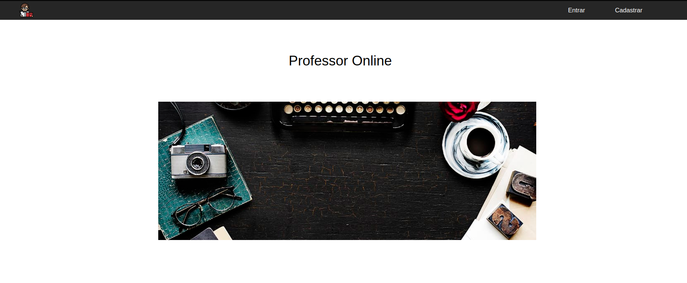
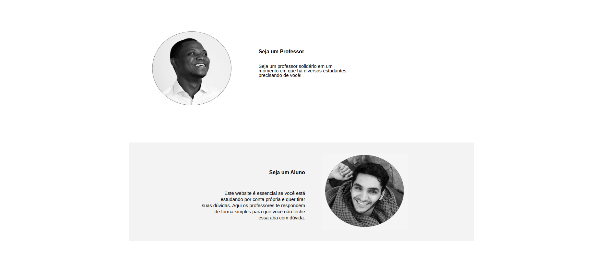

<h1>Projeto Professor Online</h1>

Projeto em que um <em>Tutor ou Professor</em> 
entra como voluntário para ensinar sobre a área que 
domina, com intuito de ajudar algum aluno que deseja aprender aquele determinado assunto. Nessa quarentena é cada vez mais importante levar educação de qualidade, pois há diversos estudantes sem aulas.

<h2><strong>Missão:</strong></h2>

<pre>
  Nossa missão é a de ajudar professores que desejam se voluntariar e dar aulas para ajudar alunos que estão há procura daquele determinado assunto. 
</pre>

<h3>Telas:</h3>

* Login
* Home
* Aula
* Perfil
* Busca

<h4>Devs</h4>

- Douglas 
  - Github: dougto
  
- Leandro Trindade 
  - Github: leandrodeveng

- Vitor 
  - Github: vithub

- Igor Marins 
  - Github: igor-py

- Mateus Alexandre 
  - Github: mateusvale

<h2>Sobre</h2>

<pre>
    Nesse período de Quarentena, caso queira ajudar um aluno a aprender um determinado assunto que você domina, não hesite em se cadastrar em nossa plataforma.

    Aqui você pode dar aula e ser avaliado por nossos alunos, num sistema de metrificação elaborado para que aulas que se destacam sejam mais visíveis pelos usuários da nossa plataforma

    E você que deseja aprender alguma nova atividade, seja ela, <em>dança, desenvolvimento web, etc.</em> Se cadastre e tenha acesso à aulas dos nossos professores voluntários.
</pre>